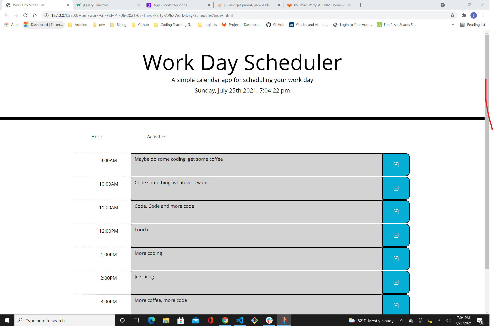

## Homework assignment 05 Third Party APIs

Assignment for fifth week, Third Party APIs: Work Day Scheduler

## ScreenShot 

## Link to URL of the deployed application 

(https://stevenslade.github.io/Homework-GT-FSF-PT-06-2021/05-Third-Party-APIs-Work-Day-Scheduler)

## URL of the Github repository

This link will take you to my homework repo (https://github.com/stevenslade/Homework-GT-FSF-PT-06-2021) from which you will find sub directories for each weekly assignment

This link will take you to the homework for this week, "05-Third-Party-APIs-Work-Day-Scheduler" folder inside my repo (https://github.com/stevenslade/Homework-GT-FSF-PT-06-2021/tree/main/05-Third-Party-APIs-Work-Day-Scheduler)

