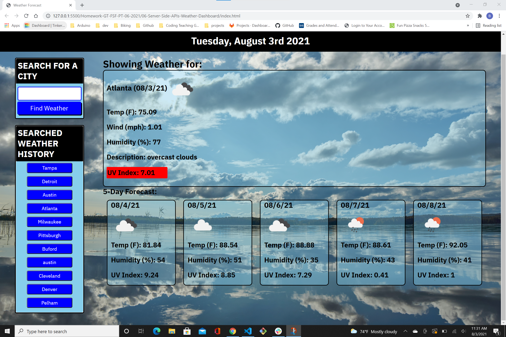

## 06 Server Side APIs

Assignment for sixth week, Server Side APIs: Weather Dashboard

## ScreenShot 

## Link to URL of the deployed application 

(https://stevenslade.github.io/Homework-GT-FSF-PT-06-2021/06-Server-Side-APIs-Weather-Dashboard)

## URL of the Github repository

This link will take you to my homework repo (https://github.com/stevenslade/Homework-GT-FSF-PT-06-2021) from which you will find sub directories for each weekly assignment

This link will take you to the homework for this week, "06-Server-Side-APIs-Weather-Dashboard" folder inside my repo (https://github.com/stevenslade/Homework-GT-FSF-PT-06-2021/tree/main/06-Server-Side-APIs-Weather-Dashboard)

